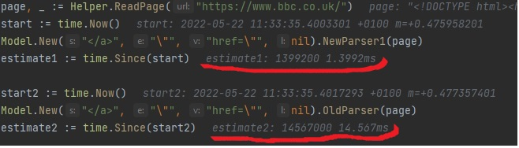

**Html element finder with GOLANG**
----

Table of contents
=================

<!--ts-->
* [Introduction](#Introduction)
* [Start Application](#Start Application)
  * [Services](#Services)
      * [Single web page](#Single web page)
      * [Restfull Api](#Restfull Api)
* [Request and Response Parameters](#Request and Response Parameters)
* [Performance](#Performance)
<!--te-->
Introduction
============
It takes a website URL and thread count as an input parameters and provides general information
about the contents of the page such as links, heading, title, version and more information.


Start Application
============

- Build
  - go build ./main.go
- Run on a special address
  - if you want run it on special ip and port, please pass ip,port with command.
    for example:
  
    main.exe -ip 192.168.65.21 -port 8585
- Run as a default
  - you can run it without parameter, in this case it run on default:
  
   (localhost:9999)
  main.exe

Services
============


Single web page
============
- Web page application
  - /page: takes address and count of workers, and shows json result on the page.

Restfull Api
============
- Post rest API
  - /find: takes request json and return json response

Request and Response Parameters
============
- Request
```json
{
  "threadCount":100,
  "address":"https://github.com/"
}
```
- Response

```json
{
  "body-status":1003,
  "time":"2022-05-22T10:28:04.0375081+01:00",
  "result":[{"FieldError":{}},{"FieldError":{}}]
}
```
- result

```json
{
  "result": {
    "Title":"Google",
    "Version":"html",
    "HasLogin":false,
    "Heading":{
      "h1":1,
      "h2":1,
      "h3":1,
      "h4":1,
      "h5":1,
      "h6":1},
    "Links":[
      {"address":"https://www.google.com","internal":true,"statusCode":404,"err":null},
      {"address":"https://www.google.com/intl/en/policies/privacy/","internal":true,"statusCode":200,"err":null},
      {"address":"https://www.google.com/services/","internal":true,"statusCode":200,"err":null},
      {"address":"https://www.google.com/intl/en/policies/terms/","internal":true,"statusCode":200,"err":null},
      {"address":"https://www.youtube.com/?gl=GBu0026tab=w1","internal":false,"statusCode":200,"err":null},
      {"address":"https://accounts.google.com/ServiceLogin?hl=enu0026passive=trueu0026continue=https://www.google.com/u0026ec=GAZAAQ","internal":false,"statusCode":200,"err":null},
      {"address":"https://www.google.co.uk/imghp?hl=enu0026tab=wi","internal":false,"statusCode":200,"err":null},
      {"address":"https://www.google.com/intl/en/ads/","internal":true,"statusCode":200,"err":null},
      {"address":"https://news.google.com/?tab=wn","internal":false,"statusCode":200,"err":null},
      {"address":"https://play.google.com/?hl=enu0026tab=w8","internal":false,"statusCode":200,"err":null},
      {"address":"https://maps.google.co.uk/maps?hl=enu0026tab=wl","internal":false,"statusCode":200,"err":null},
      {"address":"https://www.google.com/preferences","internal":true,"statusCode":200,"err":null},
      {"address":"https://www.google.com/advanced_search","internal":true,"statusCode":200,"err":null},
      {"address":"https://www.google.com/setprefdomain","internal":true,"statusCode":200,"err":null},
      {"address":"https://www.google.com/search","internal":true,"statusCode":200,"err":null},
      {"address":"https://drive.google.com/?tab=wo","internal":false,"statusCode":200,"err":null},
      {"address":"https://www.google.co.uk/intl/en/about/products?tab=wh","internal":false,"statusCode":200,"err":null},
      {"address":"https://mail.google.com/mail/?tab=wm","internal":false,"statusCode":200,"err":null},
      {"address":"https://www.google.com/intl/en/about.html","internal":true,"statusCode":200,"err":null},
      {"address":"http://www.google.co.uk/history/optout?hl=en","internal":false,"statusCode":200,"err":null}]
  }
}
```

Performance
============
for performance issues I added ThreadCount to parameters to increase performance
with parallel programing.

There are some solutions for parsing HTML in GOLANG in Github or else, But I write new method for parsing with better performance,
There is compare between my solution and other.




